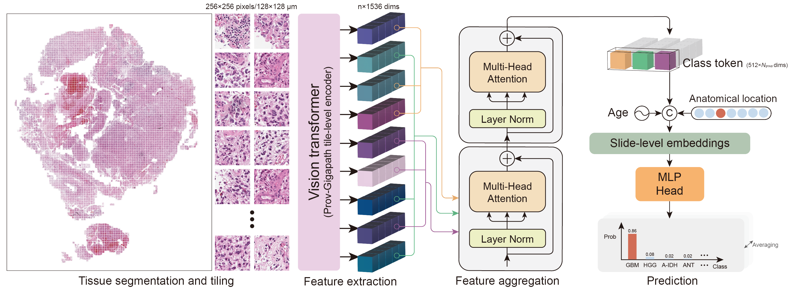

# 🧠 AI-based histopathological classification of central nervous system tumours

[[`Paper`]()] [[`BibTeX`](#Citation)]

Darui Jin*, Artem Shmatko*, Areeba Patel*, Ramin Rahmanzade, Rouzbeh Banan, Lukas Friedrich,  Philipp Sievers, Stefan Hamelmann, Daniel Schrimpf, Kirsten Göbel, Henri Bogumil, Sybren L.N. Maas,  Martin Sill, Felix Hinz, Abigail Suwala, Felix Keller, Antje Habel, Gleb Rukhovich, Samuel Rutz, Obada Al-Halabi, Sebastian Ille, Janik Sehrig, Bogdana Suchorska, Olfat Ahmad, Dominik Sturm, David Reuss, Pieter Wesseling, Adelheid Wöhrer, Frank Heppner, Christel Herold-Mende, Sandro Krieg, Wolfgang Wick, David TW Jones, Stefan Pfister, Maysa Al-Hussaini, Yanghao Hou, Felipe D’almeida Costa, Leonille Schweizer, Luca Bertero, Till Acker, Arnault Tauziede-Espariat, Pascale Varlet, Sebastian Brandner, Andreas von Deimling, Xiangzhi Bai, Felix Sahm, Moritz Gerstung (*Equal contribution)

[](https://opensource.org/licenses/MIT)


## Repository overview
<!-- 
<span style="font-size:20px;"> Welcome to the official repository of Paion <span style="font-size:14px;">(Precise AI enabled neuro-ONcolgy)</span>!</span> <br><br> -->
<p style="display: inline-block; vertical-align: middle;">
    
    <span style="font-size: 20px; vertical-align: middle;"> Welcome to the official repository of Paion 
        <span style="font-size: 14px;">(Precise AI enabled neuro-ONcology)</span>
    </span>
</p>

Paion is a **multiple instance learning (MIL)** model designed for predict methylation-based CNS tumour subtypes from digital images of **H&E slides**. 
This repository provides the complete implementation for preprocessing, including slide tiling and feature extraction, as well as the training and testing workflows for the PAION model. 
Additionally, it contains Jupyter notebooks for reproducing the figures presented in our paper, along with necessary data such as prediction results and annotations.

## Installation
Step 1: Clone the repository
```bash
git clone https://github.com/gerstung-lab/Paion.git
cd Paion
```

Step 2: Set up a virtual environment
```bash
conda create -n paion python=3.10
```

Step 3: Install dependencies
```bash
conda activate paion
pip install -r requirements.txt
```
The foundation models required for the feature extraction session are not included in the requirements file. Please access them from the corresponding sources and update the model paths in `/preprocessing/feature_extraction/get_features.py`, specifically at lines 75-76. We recommend using the following models: [https://huggingface.co/prov-gigapath/prov-gigapath](https://huggingface.co/prov-gigapath/prov-gigapath) (Prov-Gigapath, Xu et al., *Nature*, 2024) and [https://huggingface.co/MahmoodLab/UNI](https://huggingface.co/MahmoodLab/UNI) (UNI, Chen et al., *Nature Medicine*, 2024). 

## Usage
This repository provides **two** main ways to use the model:
1. **Individual modules**: Run specific task independently for customization and flexibility.
2. **End-to-end workflow**: Run the complete pipeline from slide tiling to model training/evaluation in one using `pipeline.py`.

### 1. Running individual modules
Each module is designed for a specific task. Below are the basic functionalities and usage instructions for each module:

***
#### Tiling
Purpose: Converts whole slide images (WSI) into manageable image tiles for further processing.
```bash
python preprocessing/tiling/slide_tiling.py --source_dir <WSIs_store_path> --source_list <slide_path_list.txt> --save_dir <tiles_path> --patch_size 256 --step_size 256 --mag 20
```
Key arguments:
- `source_dir`: Path to the source slide image (.svs) directory.
- `source_list`: Path to the text file containing the list of specific slide paths. If provided, not necessary to specify `source_dir`.
- `save_dir`: Path to the directory where the tiles will be saved.
- `patch_size`: Size of the tile (default: 256).
- `step_size`: Overlap between tiles (default: 256).
- `mag`: Magnification level of the slide (default: 20).

If you have access to an LSF cluster, you can use `python preprocessing/tiling/run.py` to parallelize the tiling process, significantly reducing the processing time. Before that, please update the `preprocessing/tiling/run.py` file with the correct paths and parameters.

***
#### Feature extraction
Purpose: Extracts features from the image tiles using a pre-trained model.
```bash
python preprocessing/feature_extraction/get_features.py --split <tile_path_list.txt> --feature_dir <features_path> --batchsize 384
```
Key arguments:
- `split`: Path to a .txt file listing directory paths, each corresponding to a partition of slide tile images.
- `feature_dir`: Path to the directory where the extracted features will be saved.
- `batchsize`: Batch size for feature extraction (default: 384).

Similarly, if an LSF cluster is available, you can use `python preprocessing/feature_extraction/run.py`. Update the parameters in `preprocessing/feature_extraction/run.py` file before running.

***
#### Model training/evaluation
Purpose: To Train and evaluate the PAION model using features extracted in the previous step.
```bash
python aggregator_train_val/model_run.py --dataset <dataset_path> --label <label.csv> --label_map <label_mapping.yaml> --split <split_file.yaml> --mode <train/test> --data_aug --soft_labels --exp_name <experiment_name> 
``` 
Key arguments:
- `dataset`: Path to the directory containing the extracted features (saved in .pt format).
- `label`: Path to the slide label CSV file, which should contain following columns slide, family, probability vector, age, and location. The format is as follows: `<slide | family | prob_vector (if soft_labels required) | age | location>`
- `label_map`: Path to the YAML file containing the mapping of family labels to integers. (tumor_name: integer)
- `split`: Path to the YAML file containing the train, validation, and test split information, structured as `{"train": [slide_id list], "test": [slide_id list]}`
- `mode`: Specify the mode of operation (train/test).
- `data_aug`: Enable data augmentation (default: False, store_true). This parameter is not applicable during testing.
- `soft_labels`: Enable soft labels (default: False, store_true). This parameter is not applicable during testing.
- `exp_name`: Name of the experiment.

More parameters to specify:
- `groups`: Number of feature matrix divisions within a slide during training (default: 3).
- `classes`: Output class number by the classifier. Redundant classes could be set (*n*>actual classes) to improve classification performance (default: 186).
- `cl_weight`: Weight for contrastive loss (default: 20).
- `resume`: Resume training from the latest checkpoint (default: false, store_true).
- `output_dir`: Path to the prediction results from testing (default: `aggregator_train_val/predictions`).

Other parameters can be modified in the `aggregator_train_val/config.yaml` file.
Examples of the label mapping, split files and label CSV files can be found in the `aggregator_train_val/annot_files` directory. log files and checkpoints will be saved in the `aggregator_train_val/logs/exp_name` directory by default.

***
### 2. Running the end-to-end workflow
The `pipeline.py` script is designed to run the complete pipeline from slide tiling to model training and evaluation in one go.

```bash
python pipeline.py --tiling  --model_run --slide_dir <WSIs_store_path> --slide_list <slide_path_list.txt> --tile_savedir <tiles_path> --feature_extraction --batchsize 256 --feature_dir <features_path> --model_run --dataset <dataset_path> --label <label.csv> --label_map <label_mapping.yaml> --split <split_file.yaml> --mode <train/test> --data_aug --soft_labels --exp_name <experiment_name>
```

The key arguments `--tiling`, `--feature_extraction`, and `--model_run` are used to specify the tasks to be executed. At least one of them should be set as `True` when runnig the script. The rest of the arguments are the same as described in the individual modules.

## Figure reproduction
The scripts for reproducing the figures presented in the paper are available in the `Paion_plots.ipynb` directory. The necessary data files are provided in the `human_vs_machine` and `labels` directory. `matplotlib`, `seaborn`, `sklearn`, `h5py` and `pandas` are required to run the notebook.

## Hardware requirements
The model training/evaluation and the feature extraction require a GPU with at least 11GB of memory. Feature extraction with larger batch sizes may require more memory. The tiling process can be run on a CPU with support for multi-core parallel processing to improve efficiency.

## Citation
```bibtex
@article{jin2024ai,
  title={AI-based histopathological classification of central nervous system tumours},
  author={Jin, Darui and Shmatko, Artem and Patel, Areeba, ..., Sahm, Felix and Gerstung, Moritz},
  journal={medRxiv},
  year={2024},
  publisher={Cold Spring Harbor Laboratory Press}
}
```

## Acknowledgements
This work was partially built upon implementations from [CLAM](https://github.com/mahmoodlab/CLAM) and [TransMIL](https://github.com/szc19990412/TransMIL).


