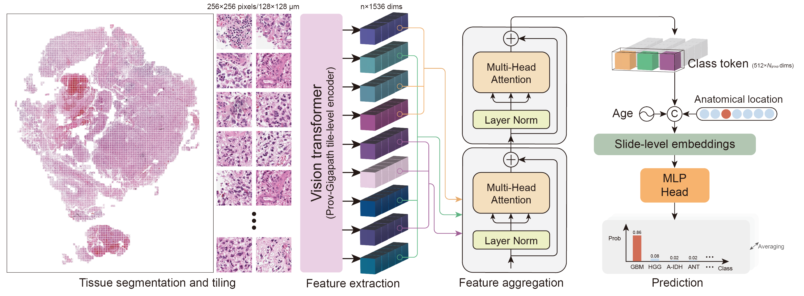

# 🧠 AI-based histopathological classification of central nervous system tumours

[[`Paper`]()] [[`BibTeX`](#Citation)]

Darui Jin*, Artem Shmatko*, Areeba Patel*, Ramin Rahmanzade, Rouzbeh Banan, Lukas Friedrich,  Philipp Sievers, Stefan Hamelmann, Daniel Schrimpf, Kirsten Göbel, Henri Bogumil, Sybren L.N. Maas,  Martin Sill, Felix Hinz, Abigail Suwala, Felix Keller, Antje Habel, Gleb Rukhovich, Samuel Rutz, Obada Al-Halabi, Sebastian Ille, Janik Sehrig, Bogdana Suchorska, Olfat Ahmad, Dominik Sturm, David Reuss, Pieter Wesseling, Adelheid Wöhrer, Frank Heppner, Christel Herold-Mende, Sandro Krieg, Wolfgang Wick, David TW Jones, Stefan Pfister, Maysa Al-Hussaini, Yanghao Hou, Felipe D’almeida Costa, Leonille Schweizer, Luca Bertero, Till Acker, Arnault Tauziede-Espariat, Pascale Varlet, Sebastian Brandner, Andreas von Deimling, Xiangzhi Bai, Felix Sahm, Moritz Gerstung (*Equal contribution)

[](https://opensource.org/licenses/MIT)


## Repository overview
<!-- 
<span style="font-size:20px;"> Welcome to the official repository of Paion <span style="font-size:14px;">(Precise AI enabled neuro-ONcolgy)</span>!</span> <br><br> -->
<p style="display: inline-block; vertical-align: middle;">
    
    <span style="font-size: 20px; vertical-align: middle;"> Welcome to the official repository of Hetairos 
        <span style="font-size: 14px;">(H&E Trained AI for Recognition of Oncology Slides)</span>
    </span>
</p>

Hetairos is a **multiple instance learning (MIL)** model designed to predict methylation-based CNS tumour subtypes from digital images of **H&E slides**. 
This repository provides the complete implementation for preprocessing, including slide tiling and feature extraction, as well as the training and testing workflows for the Hetairos model. 
Additionally, it contains Jupyter notebooks for reproducing the figures presented in our paper, along with necessary data such as prediction results and annotations.

## Installation
Step 1: Clone the repository
```bash
git clone https://github.com/gerstung-lab/Hetairos.git
cd Hetairos
```

Step 2: Set up a virtual environment
```bash
conda create -n hetairos python=3.10
```

Step 3: Install dependencies
```bash
conda activate hetairos
pip install -e .
```

This installs Hetairos in editable mode and exposes command-line tools such as `hetairos-tile`, `hetairos-extract`, `hetairos-train`, `hetairos-test`, and `hetairos`.

The tiling step uses OpenSlide. If the native OpenSlide library is not available in your environment, install it before running tiling, for example:
```bash
conda install -c conda-forge openslide
```

Optional notebook dependencies can be installed when needed:
```bash
pip install -e ".[plots]"
pip install -e ".[reports]"
```

The foundation model weights required for feature extraction are not included in the package. The default feature extractor uses `hf_hub:prov-gigapath/prov-gigapath` through `timm`, so the first run may need internet access and the required Hugging Face permissions. The Prov-Gigapath tile-level encoder was used for the results in the paper. Other encoders, such as [UNI](https://huggingface.co/MahmoodLab/UNI), can be used by updating the model creation line in `hetairos/preprocessing/feature_extraction/get_features.py`.

## Usage
This repository provides **two** main ways to use the model:
1. **Individual modules**: Run specific task independently for customization and flexibility.
2. **End-to-end workflow**: Run the complete pipeline from slide tiling to model training/evaluation in one using the `hetairos` command.

### 1. Running individual modules
Each module is designed for a specific task. Below are the basic functionalities and usage instructions for each module:

#### :scissors: Tiling
Purpose: Converts whole slide images (WSI) into manageable image tiles for further processing.
```bash
hetairos-tile --source_dir <WSIs_store_path> --save_dir <tiles_path> --patch_size 256 --step_size 256 --mag 20
hetairos-tile --source_list <slide_path_list.txt> --save_dir <tiles_path> --patch_size 256 --step_size 256 --mag 20
```
Key arguments:
- `source_dir`: Path to a directory containing slide images. The command scans this directory for `.svs`, `.ndpi`, and `.scn` files.
- `source_list`: Path to a text file with one slide path per line. Mutually exclusive with `source_dir`.
- `save_dir`: Path to the directory where outputs will be saved. The command creates `tiles/`, `masks/`, `stitches/`, and `slide_info_<index>.csv` under this directory.
- `patch_size`: Size of the tile (default: 256).
- `step_size`: Step size between neighboring tiles (default: 256).
- `mag`: Nominal magnification level of the slide (default: 20).
- `index`: Batch index used only to name `slide_info_<index>.csv` (default: 0).

The tiling grid is globally aligned from the slide origin. Candidate tile coordinates are filtered by the segmented tissue contours before image tiles are saved.

#### :wrench: Feature extraction
Purpose: Extracts features from the image tiles using a pre-trained model.
```bash
hetairos-extract --tile_paths_file <tile_paths.txt> --feature_dir <features_path> --batchsize 768
hetairos-extract --tile_dir <tile_dir_or_tiles_root> --feature_dir <features_path> --batchsize 768
```
Key arguments:
- `tile_paths_file`: Path to a .txt file with one tile-image directory per line. Each directory should contain the tile JPGs for one slide, named like `<slide_id>_x_y_<x>_<y>.jpg`. The legacy alias `--split` is also accepted.
- `tile_dir`: Path to a directory containing tile JPGs directly, or a root directory whose immediate subdirectories each contain one slide's tile JPGs. Mutually exclusive with `tile_paths_file`.
- `feature_dir`: Path to the directory where the extracted features will be saved.
- `batchsize`: Batch size for feature extraction (default: 768).

Feature extraction writes intermediate HDF5 files to `<feature_dir>/h5_files/` and PyTorch tensor files to `<feature_dir>/pt_files/`. The `.pt` filenames are derived from the tile directory names, so each tile directory should correspond to one slide ID.

#### :robot: Model training/evaluation
Purpose: To Train and evaluate the Hetairos model using features extracted in the previous step.
```bash
hetairos-train --dataset <dataset_path> --label <label.csv> --label_map <label_mapping.yaml> --split <split_file.yaml> --mode train --data_aug --soft_labels --exp_name <experiment_name>
hetairos-test --dataset <dataset_path> --label <label.csv> --label_map <label_mapping.yaml> --split <split_file.yaml> --mode test --exp_name <experiment_name>
``` 
Key arguments:
- `dataset`: Path to the directory containing the extracted features (saved in .pt format).
- `label`: Path to the slide label CSV file, which should contain following columns slide, family, probability vector, age, and location. The format is as follows: `<slide | family | prob_vector (if soft_labels required) | age | location>`
- `label_map`: Path to the YAML file containing the mapping of family labels to integers, structured as `{"mapping": {"tumor_name": integer_id}}`.
- `split`: Path to the YAML file containing train and test slide IDs, structured as `{"train": [slide_id list], "test": [slide_id list]}`. The `test` split is used as the validation set during training and as the test set during testing.
- `mode`: Specify the mode of operation (train/test).
- `data_aug`: Enable data augmentation (default: False, store_true). This parameter is not applicable during testing.
- `soft_labels`: Enable soft labels (default: False, store_true). This parameter is not applicable during testing.
- `exp_name`: Name of the experiment.

More parameters to specify:
- `groups`: Number of feature matrix splits within a slide during training (default: 3).
- `classes`: Output class number by the classifier. Redundant classes could be set (*n*>actual classes) to improve classification performance (default: 186).
- `cl_weight`: Weight for contrastive loss (default: 20).
- `resume`: Resume training from the latest checkpoint (default: false, store_true).
- `output_dir`: Path to the prediction results from testing (default: `./predictions`).

Other training parameters can be modified in `hetairos/aggregator_train_val/config.yaml` or by passing `--config <model_config.yaml>` to `hetairos-train` / `hetairos-test`. Example label mapping and split files are provided as `Tumor_label_mapping.yaml` and `train_val_split.yaml`. Log files and checkpoints are saved under the configured `General.log_path` directory. In test mode, Hetairos loads the best checkpoint from `<General.log_path>/<exp_name>/` when a checkpoint filename contains a score such as `multi_acc=...`; otherwise it falls back to `last.ckpt` or the most recently modified checkpoint.

The tumor locations that are available are: 
- `Extracranial`
- `Infratentorial`
- `Intra- or Peri-Ventricular`
- `Intra- or Supra-Sellar`
- `Pineal`
- `Spinal`
- and `Supratentorial`

### 2. Running the end-to-end workflow
The `hetairos` command is designed to run the complete pipeline from slide tiling to model training and evaluation in one go.

```bash
hetairos --tiling --slide_dir <WSIs_store_path> --tile_savedir <tiles_path> --feature_extraction --feature_dir <features_path> --model_run --label <label.csv> --label_map <label_mapping.yaml> --split <split_file.yaml> --mode train --exp_name <experiment_name>
hetairos --tiling --slide_list <slide_path_list.txt> --tile_savedir <tiles_path> --feature_extraction --feature_dir <features_path> --model_run --label <label.csv> --label_map <label_mapping.yaml> --split <split_file.yaml> --mode train --exp_name <experiment_name>
```

The key arguments `--tiling`, `--feature_extraction`, and `--model_run` are used to specify the tasks to be executed. At least one of them should be set as `True` when running the command. When feature extraction follows tiling, `hetairos` writes `<tile_savedir>/tile_paths.txt` from `<tile_savedir>/tiles/*` automatically. When model training/testing follows feature extraction, `--dataset` can be omitted and defaults to `<feature_dir>/pt_files`. For train mode, `--split` is required; for test mode, it can be omitted and will be generated from the `.pt` files in the dataset directory.

Less frequently changed end-to-end settings are stored in the pipeline config file, which defaults to `hetairos/pipeline_config.yaml`. Pass `--config <pipeline_config.yaml>` to override them:

```yaml
tiling:
  patch_size: 256
  step_size: 256
  mag: 20
  index: 0

feature_extraction:
  batchsize: 768

model_run:
  model_config: null
  model: ATransMIL
  groups: 3
  classes: 186
  cl_weight: 20
  data_aug: false
  soft_labels: false
  resume: false
  accelerator: auto
  devices: auto
  precision: 16-mixed
```

The individual commands `hetairos-tile`, `hetairos-extract`, and `hetairos-train` still expose these advanced settings as CLI options for module-level debugging.

In the end-to-end command, `--config` refers to the pipeline config shown above. In the standalone training/testing commands, `--config` refers to the model config, usually `hetairos/aggregator_train_val/config.yaml`. If `model_run.model_config` is `null` in the pipeline config, the package default model config is used. If it is set to a relative path, the path is resolved relative to the pipeline config file.

## Figure reproduction
The scripts for reproducing the figures presented in the paper are available in the `Hetairos_plots.ipynb` directory. The necessary data files are provided in the `human_vs_machine` and `labels` directory. Install the plotting extras with `pip install -e ".[plots]"` before running the notebook.

## Hardware requirements
Tiling runs on CPU and benefits from multiple cores. By default, tiling uses up to 16 workers and never more than the available CPU core count.

Feature extraction and model training/evaluation are designed for GPU use. Feature extraction can fall back to CPU but will be slow for large tile sets. Model training/testing automatically selects GPU when CUDA is available and otherwise falls back to CPU; if CPU is used with mixed precision configured, the trainer falls back to `32-true` precision.

## Citation
```bibtex
@article{jin2024ai,
  title={AI-based histopathological classification of central nervous system tumours},
  author={Jin, Darui and Shmatko, Artem and Patel, Areeba, ..., Sahm, Felix and Gerstung, Moritz},
  journal={medRxiv},
  year={2024},
  publisher={Cold Spring Harbor Laboratory Press}
}
```

## Acknowledgements
This work was partially built upon implementations from [CLAM](https://github.com/mahmoodlab/CLAM) and [TransMIL](https://github.com/szc19990412/TransMIL).
