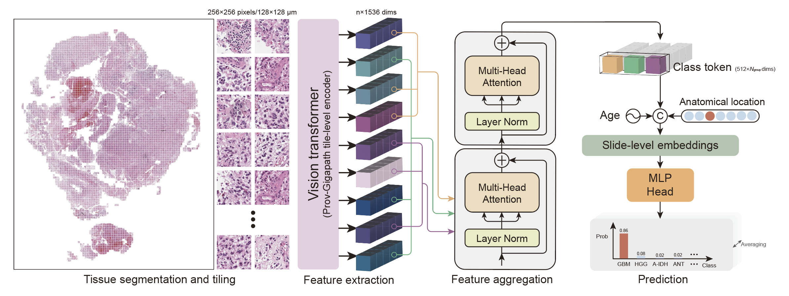

# 🧠 AI-based histopathological classification of central nervous system tumours

[[`Paper`]()] [[`BibTeX`](#Citation)]

Darui Jin*, Artem Shmatko*, Areeba Patel*, ..., Felix Sahm, Moritz Gerstung (*Equal contribution)

## Repository overview
Welcome to the official repository of **Paion**! 

Paion is a **multiple instance learning (MIL)** based model to predict methylation-based CNS tumour subtypes from digital images of **H&E slides**. 
This repository provides the complete implementation for preprocessing, including slide tiling and feature extraction, as well as the training and testing workflows for the PAION model. 
Additionally, it contains Jupyter notebooks for reproducing the figures presented in our paper, along with necessary data such as prediction results and annotations.
